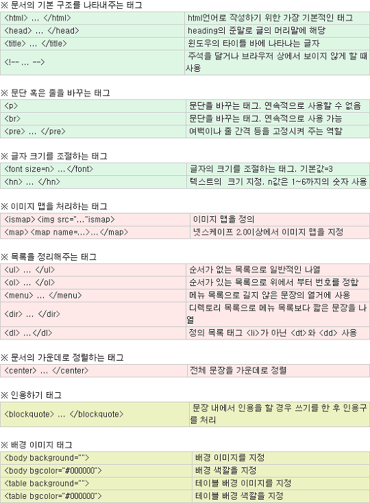

---
​---
defaults:
  # _posts
  - scope:
      path: ""
      type: posts
    values:
      title:  "HTML 기초 지식 (2)"
      layout: single
      author_profile: true
      read_time: true
      comments: true
      share: true
      related: true
​---
---


#  	HTML 기초지식 (2)

###  	HTML 만들어보기

HTML 파일을 간단하게 한번 제작해보도록 할게요.

일단 가장 첫 줄에 아래의 코드를 입력합니다.

이 부분은 해당 문서의 타입이 html이라고 선언하는 부분입니다.

```
<!doctype html>
```


그 다음에는 html 태그를 추가해야하는데 모든 내용은 html 태그 안에 들어가야합니다. 

html 태그 안에는 head와 body태그를 넣을 수 있습니다.

head태그는 웹 페이지에서 보이지 않는 정보들을 담는 영역입니다.

body태그는 웹 페이지에서 직접적으로 보이는 내용들이 들어갑니다. 

```
<!doctype html>
<html>
	<head>
		<title>홈페이지 제작 시작</title>
	</head>
	<body>
		홈페이지 제작 연습중입니다.
	</body>
</html>
```


이렇게 html 파일을 hello.html로 저장한 후 확인해보면 title태그에 넣었던 문구는 브라우저 탭에 나타나고, body 태그에 넣었던 내용들은 웹페이지에 나타는 것을 알 수 있습니다. 

이렇게 보면 크게 어려워보이진 않죠?


## 다양한 태그들 소개 

실제로 웹 페이지를 제작할때는 다양한 태그들이 사용되는 것을 확인할 수 있습니다.

```
<body>
	<h1>나의 첫 홈페이지</h1>
	<p>나의 홈페이지를 소개합니다. </p>
	<div>
		<div>
			<p>
			페이지 제작 연습을 통해서 좋은 개발자가 됩시다.<br>
			아자아자 화이팅.
			</p>
		</div>
	</div>
</body>
```





다양한 태그가 존재한다는 것을 알 수 있을거에요. 

굉장히 많아보이지만 자주 사용하다보면 기억하시는데 무리는 없으실거에요.


요점정리:

- 태그와 태그는 중첩될 수 있음.
- !doctype을 첫번째 줄에 선언.
- html 태그는 페이지 전체를 감싸안음
- head 태그 안에는 해당 페이지의 보이지 않는 정보들 위치
- body 태그 안에는 웹 브라우저 페이지에 보여지는 정보들 위치
- 소스 내 줄바꿈과 들여쓰기로 태그의 중첩 등을 보기 쉽게 표현
- 대신 보여지는 페이지 내의 줄바꿈과 들여쓰기는 다른 방식으로 표현

